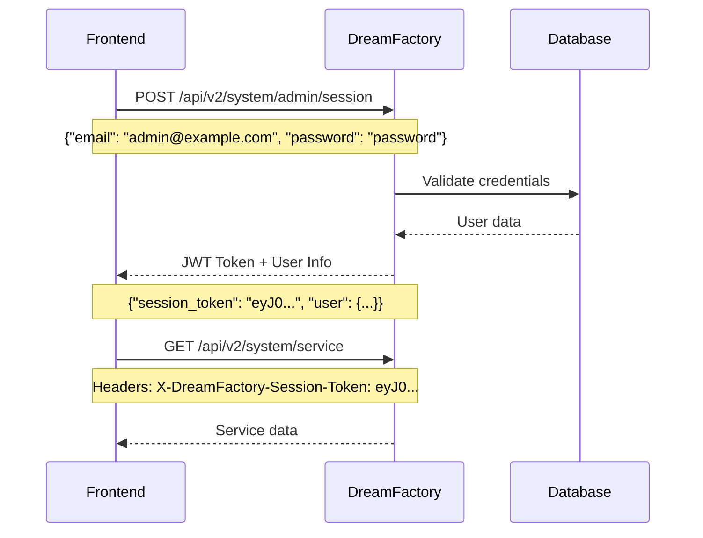

# DreamFactory API Analysis and Frontend Integration Guide

## Overview

DreamFactory is a REST API platform that provides a unified interface for accessing various backend services including databases, file systems, external APIs, and more. This document provides a comprehensive analysis of the DreamFactory API system and guidelines for frontend integration.

## Base API Structure

### Core API Endpoints

- **Base URL**: `/api/v2` (or configurable via `df.api_route_prefix`)
- **Status Endpoint**: `/status` (system health and status)
- **Route Pattern**: `/api/v2/{service}/{resource?}`
- **Versioned Pattern**: `/api/v2/{version}/{service}/{resource?}`

### HTTP Methods Supported

DreamFactory supports all standard REST HTTP methods:
- `GET` - Retrieve resources
- `POST` - Create resources
- `PUT` - Update/replace resources
- `PATCH` - Partial updates
- `DELETE` - Remove resources
- `OPTIONS` - CORS preflight and metadata
- `HEAD` - Headers only

## Authentication and Authorization

### Authentication Methods

DreamFactory supports multiple authentication mechanisms:

#### 1. JWT (JSON Web Tokens)
- **Header**: `X-DreamFactory-Session-Token`
- **Format**: Bearer token
- **Expiration**: Configurable TTL
- **Refresh**: Automatic refresh for "forever" tokens

#### 2. API Key Authentication
- **Header**: `X-DreamFactory-API-Key`
- **Query Parameter**: `api_key`
- **Usage**: Application-level authentication

#### 3. Basic Authentication
- **Header**: `Authorization: Basic {base64(username:password)}`
- **Usage**: Direct credential authentication

#### 4. OAuth Integration
- **Providers**: Google, Facebook, GitHub, etc.
- **Flow**: Standard OAuth 2.0 authorization code flow

### Authentication Flow



### Session Management

#### Login
```http
POST /api/v2/system/admin/session
Content-Type: application/json

{
    "email": "admin@example.com",
    "password": "password",
    "remember_me": true
}
```

#### Response
```json
{
    "session_token": "eyJ0eXAiOiJKV1QiLCJhbGciOiJIUzI1NiJ9...",
    "session_id": "admin",
    "id": 1,
    "name": "Admin User",
    "first_name": "Admin",
    "last_name": "User",
    "email": "admin@example.com",
    "is_sys_admin": true,
    "is_active": true,
    "role": "Admin"
}
```

#### Refresh Token
```http
PUT /api/v2/system/admin/session
X-DreamFactory-Session-Token: {current_token}
```

#### Logout
```http
DELETE /api/v2/system/admin/session
X-DreamFactory-Session-Token: {token}
```

## System Resources API

### Admin Resources (`/api/v2/system/admin/*`)

#### Users Management
- `GET /api/v2/system/admin` - List administrators
- `POST /api/v2/system/admin` - Create administrator
- `GET /api/v2/system/admin/{id}` - Get administrator details
- `PUT /api/v2/system/admin/{id}` - Update administrator
- `DELETE /api/v2/system/admin/{id}` - Delete administrator

#### Admin Session Management
- `GET /api/v2/system/admin/session` - Get current session
- `POST /api/v2/system/admin/session` - Login
- `PUT /api/v2/system/admin/session` - Refresh token
- `DELETE /api/v2/system/admin/session` - Logout

#### Admin Profile Management
- `GET /api/v2/system/admin/profile` - Get admin profile
- `POST /api/v2/system/admin/profile` - Update profile

#### Password Management
- `POST /api/v2/system/admin/password` - Change password
- `PUT /api/v2/system/admin/password` - Reset password

### Application Management (`/api/v2/system/app/*`)

```http
GET /api/v2/system/app
```

```json
{
    "resource": [
        {
            "id": 1,
            "name": "admin",
            "api_key": "36fda24fe5588fa4285ac6c6c2fdfda470db68c7",
            "description": "DreamFactory Admin Console",
            "is_active": true,
            "type": 3,
            "path": "/admin",
            "url": "https://example.com/admin"
        }
    ]
}
```

### Service Management (`/api/v2/system/service/*`)

#### List Services
```http
GET /api/v2/system/service
```

#### Create Service
```http
POST /api/v2/system/service
Content-Type: application/json

{
    "name": "mysql_db",
    "label": "MySQL Database",
    "description": "Main application database",
    "is_active": true,
    "type": "mysql",
    "config": {
        "host": "localhost",
        "port": 3306,
        "database": "app_db",
        "username": "db_user",
        "password": "db_password"
    }
}
```

### Role Management (`/api/v2/system/role/*`)

#### Create Role with Service Access
```http
POST /api/v2/system/role
Content-Type: application/json

{
    "name": "mobile_app_role",
    "description": "Role for mobile app users",
    "is_active": true,
    "role_service_access_by_role_id": [
        {
            "service_id": 2,
            "component": "*",
            "verb_mask": 31,
            "requestor_mask": 1
        }
    ]
}
```

### Email Templates (`/api/v2/system/email_template/*`)

### CORS Configuration (`/api/v2/system/cors/*`)

### System Configuration (`/api/v2/system/custom/*`)

### Lookup Keys (`/api/v2/system/lookup/*`)

### Cache Management (`/api/v2/system/cache/*`)

#### Clear Cache
```http
DELETE /api/v2/system/cache
```

### Constants (`/api/v2/system/constant/*`)

#### Get System Constants
```http
GET /api/v2/system/constant
```

### Environment (`/api/v2/system/environment`)

#### Get Environment Info
```http
GET /api/v2/system/environment
```

### Events (`/api/v2/system/event`)

### Package Import/Export (`/api/v2/system/package/*`)

### Service Types (`/api/v2/system/service_type`)

## Database Service APIs

### SQL Database Services

Pattern: `/api/v2/{db_service_name}/*`

#### Schema Operations
- `GET /api/v2/mysql_db/_schema` - Get database schema
- `GET /api/v2/mysql_db/_schema/table_name` - Get table schema
- `POST /api/v2/mysql_db/_schema` - Create table

#### Table Operations
- `GET /api/v2/mysql_db/_table` - List tables
- `GET /api/v2/mysql_db/table_name` - Get records
- `POST /api/v2/mysql_db/table_name` - Create records
- `PUT /api/v2/mysql_db/table_name` - Update records
- `PATCH /api/v2/mysql_db/table_name` - Partial update
- `DELETE /api/v2/mysql_db/table_name` - Delete records

#### Query Parameters
- `fields` - Select specific fields
- `filter` - WHERE conditions
- `limit` - Limit results
- `offset` - Pagination offset
- `order` - Sort order
- `group` - GROUP BY
- `having` - HAVING conditions
- `related` - Include related data
- `include_count` - Include total count
- `include_schema` - Include schema metadata

#### Example Database Queries

##### Get Records with Filtering
```http
GET /api/v2/mysql_db/users?filter=status%3D1&fields=id,name,email&limit=10&offset=0
X-DreamFactory-Session-Token: {token}
```

##### Create Record
```http
POST /api/v2/mysql_db/users
Content-Type: application/json
X-DreamFactory-Session-Token: {token}

{
    "resource": [
        {
            "name": "John Doe",
            "email": "john@example.com",
            "status": 1
        }
    ]
}
```

##### Update Record
```http
PUT /api/v2/mysql_db/users/123
Content-Type: application/json
X-DreamFactory-Session-Token: {token}

{
    "name": "Jane Doe",
    "email": "jane@example.com"
}
```

### NoSQL Database Services

#### MongoDB
- `GET /api/v2/mongodb/collection_name`
- `POST /api/v2/mongodb/collection_name`

#### CouchDB
- `GET /api/v2/couchdb/database_name`
- `POST /api/v2/couchdb/database_name`

#### DynamoDB
- `GET /api/v2/dynamodb/table_name`
- `POST /api/v2/dynamodb/table_name`

## File Service APIs

### File Operations

Pattern: `/api/v2/{file_service_name}/*`

#### Directory Operations
- `GET /api/v2/files/` - List root directory
- `GET /api/v2/files/folder/` - List folder contents
- `POST /api/v2/files/folder/` - Create folder

#### File Operations
- `GET /api/v2/files/path/file.txt` - Download file
- `POST /api/v2/files/path/` - Upload file
- `PUT /api/v2/files/path/file.txt` - Update file
- `DELETE /api/v2/files/path/file.txt` - Delete file

#### File Upload Example
```http
POST /api/v2/files/uploads/
Content-Type: multipart/form-data
X-DreamFactory-Session-Token: {token}

--boundary
Content-Disposition: form-data; name="file"; filename="document.pdf"
Content-Type: application/pdf

[file content]
--boundary--
```

#### File Download with URL
```http
GET /api/v2/files/documents/report.pdf?download=true
X-DreamFactory-Session-Token: {token}
```

## External API Services

### REST API Services

Pattern: `/api/v2/{remote_service_name}/*`

#### Proxy Requests
```http
GET /api/v2/external_api/users/123
X-DreamFactory-Session-Token: {token}
```

### SOAP Services

Pattern: `/api/v2/{soap_service_name}/*`

## Email Services

### Send Email

```http
POST /api/v2/email_service
Content-Type: application/json
X-DreamFactory-Session-Token: {token}

{
    "to": [{"email": "user@example.com", "name": "User Name"}],
    "subject": "Test Email",
    "body_html": "<h1>Hello World</h1>",
    "body_text": "Hello World",
    "from_email": "noreply@example.com",
    "from_name": "System"
}
```

## Error Handling

### Standard Error Response Format

```json
{
    "error": {
        "code": 401,
        "message": "Unauthorized",
        "context": "Invalid session token"
    }
}
```

### Common HTTP Status Codes

- `200` - OK (Success)
- `201` - Created
- `204` - No Content (Success with no response body)
- `400` - Bad Request (Invalid request)
- `401` - Unauthorized (Authentication required)
- `403` - Forbidden (Insufficient permissions)
- `404` - Not Found (Resource not found)
- `409` - Conflict (Resource already exists)
- `422` - Unprocessable Entity (Validation errors)
- `429` - Too Many Requests (Rate limiting)
- `500` - Internal Server Error

### Validation Errors

```json
{
    "error": {
        "code": 422,
        "message": "Validation failed",
        "context": {
            "email": ["The email field is required"],
            "password": ["The password must be at least 8 characters"]
        }
    }
}
```

## Rate Limiting

DreamFactory implements configurable rate limiting:

### Rate Limit Headers
```http
X-RateLimit-Limit: 1000
X-RateLimit-Remaining: 999
X-RateLimit-Reset: 1640995200
```

### Rate Limit Configuration
- Per-service limits
- Per-user limits
- Per-API key limits
- Time window configuration

## Real-time Communication

### Server-Sent Events (SSE)

```javascript
const eventSource = new EventSource('/api/v2/system/event?api_key=your_api_key');
eventSource.onmessage = function(event) {
    const data = JSON.parse(event.data);
    console.log('Event received:', data);
};
```

### WebSocket Support

WebSocket connections are available for real-time data streaming:

```javascript
const ws = new WebSocket('ws://your-domain.com/api/v2/websocket?session_token=your_jwt_token');
```

## API Documentation and Discovery

### Swagger/OpenAPI Documentation

```http
GET /api/v2/api_docs
```

### Service Discovery

```http
GET /api/v2/
```

```json
{
    "services": [
        {
            "id": 1,
            "name": "system",
            "label": "System Management",
            "description": "Service for managing system resources",
            "type": "system"
        }
    ],
    "service_types": [
        {
            "name": "system",
            "label": "System Management",
            "group": "System",
            "description": "System management service"
        }
    ]
}
```

## Frontend Integration Patterns

### 1. Authentication Service

```javascript
class DreamFactoryAuth {
    constructor(baseUrl, apiKey) {
        this.baseUrl = baseUrl;
        this.apiKey = apiKey;
        this.sessionToken = localStorage.getItem('df_session_token');
    }

    async login(email, password, rememberMe = false) {
        const response = await fetch(`${this.baseUrl}/api/v2/system/admin/session`, {
            method: 'POST',
            headers: {
                'Content-Type': 'application/json',
                'X-DreamFactory-API-Key': this.apiKey
            },
            body: JSON.stringify({
                email,
                password,
                remember_me: rememberMe
            })
        });

        if (response.ok) {
            const data = await response.json();
            this.sessionToken = data.session_token;
            localStorage.setItem('df_session_token', this.sessionToken);
            return data;
        } else {
            throw new Error('Login failed');
        }
    }

    async logout() {
        if (this.sessionToken) {
            await fetch(`${this.baseUrl}/api/v2/system/admin/session`, {
                method: 'DELETE',
                headers: {
                    'X-DreamFactory-Session-Token': this.sessionToken
                }
            });
            this.sessionToken = null;
            localStorage.removeItem('df_session_token');
        }
    }

    getAuthHeaders() {
        const headers = {
            'Content-Type': 'application/json'
        };
        
        if (this.sessionToken) {
            headers['X-DreamFactory-Session-Token'] = this.sessionToken;
        } else if (this.apiKey) {
            headers['X-DreamFactory-API-Key'] = this.apiKey;
        }
        
        return headers;
    }
}
```

### 2. API Client Service

```javascript
class DreamFactoryClient {
    constructor(baseUrl, auth) {
        this.baseUrl = baseUrl;
        this.auth = auth;
    }

    async get(endpoint, params = {}) {
        const url = new URL(`${this.baseUrl}/api/v2/${endpoint}`);
        Object.keys(params).forEach(key => 
            url.searchParams.append(key, params[key])
        );

        const response = await fetch(url, {
            method: 'GET',
            headers: this.auth.getAuthHeaders()
        });

        return this.handleResponse(response);
    }

    async post(endpoint, data) {
        const response = await fetch(`${this.baseUrl}/api/v2/${endpoint}`, {
            method: 'POST',
            headers: this.auth.getAuthHeaders(),
            body: JSON.stringify(data)
        });

        return this.handleResponse(response);
    }

    async put(endpoint, data) {
        const response = await fetch(`${this.baseUrl}/api/v2/${endpoint}`, {
            method: 'PUT',
            headers: this.auth.getAuthHeaders(),
            body: JSON.stringify(data)
        });

        return this.handleResponse(response);
    }

    async delete(endpoint) {
        const response = await fetch(`${this.baseUrl}/api/v2/${endpoint}`, {
            method: 'DELETE',
            headers: this.auth.getAuthHeaders()
        });

        return this.handleResponse(response);
    }

    async handleResponse(response) {
        if (response.status === 401) {
            // Handle token expiration
            await this.auth.refreshToken();
            // Retry the request
        }

        if (!response.ok) {
            const error = await response.json();
            throw new Error(error.error?.message || 'API request failed');
        }

        return response.json();
    }
}
```

### 3. Resource-Specific Services

```javascript
class UserService {
    constructor(client) {
        this.client = client;
    }

    async getUsers(filters = {}) {
        return this.client.get('mysql_db/users', filters);
    }

    async createUser(userData) {
        return this.client.post('mysql_db/users', {
            resource: [userData]
        });
    }

    async updateUser(id, userData) {
        return this.client.put(`mysql_db/users/${id}`, userData);
    }

    async deleteUser(id) {
        return this.client.delete(`mysql_db/users/${id}`);
    }
}
```

### 4. File Upload Service

```javascript
class FileService {
    constructor(client) {
        this.client = client;
    }

    async uploadFile(file, path = '') {
        const formData = new FormData();
        formData.append('file', file);

        const response = await fetch(`${this.client.baseUrl}/api/v2/files/${path}`, {
            method: 'POST',
            headers: {
                'X-DreamFactory-Session-Token': this.client.auth.sessionToken
            },
            body: formData
        });

        return response.json();
    }

    async downloadFile(filePath) {
        const response = await fetch(`${this.client.baseUrl}/api/v2/files/${filePath}?download=true`, {
            headers: this.client.auth.getAuthHeaders()
        });

        return response.blob();
    }
}
```

## Security Considerations

### 1. Token Management
- Store JWT tokens securely (avoid localStorage for sensitive apps)
- Implement automatic token refresh
- Handle token expiration gracefully
- Clear tokens on logout

### 2. API Key Protection
- Never expose API keys in client-side code
- Use environment variables for configuration
- Rotate API keys regularly

### 3. CORS Configuration
- Configure CORS properly for your domain
- Restrict origins in production
- Set appropriate headers

### 4. Input Validation
- Validate all user inputs on frontend
- Sanitize data before sending to API
- Handle validation errors from backend

### 5. Error Handling
- Don't expose sensitive error details to users
- Log errors appropriately
- Provide user-friendly error messages

## Performance Optimization

### 1. Caching Strategies
- Implement client-side caching for static data
- Use ETags for conditional requests
- Cache service configurations and schemas

### 2. Pagination
- Always use pagination for large datasets
- Implement infinite scrolling or page-based navigation
- Use `limit` and `offset` parameters

### 3. Field Selection
- Use `fields` parameter to limit returned data
- Only request needed fields to reduce payload size

### 4. Batch Operations
- Use batch endpoints when available
- Group multiple operations when possible

## Testing and Development

### 1. Development Environment
- Use separate DreamFactory instances for dev/staging/production
- Configure different API keys per environment
- Mock API responses for offline development

### 2. API Testing
- Use tools like Postman or Insomnia for API testing
- Create automated tests for critical API calls
- Test error scenarios and edge cases

### 3. Monitoring
- Monitor API response times
- Track error rates and patterns
- Set up alerts for service availability

## Best Practices

### 1. API Design
- Follow RESTful conventions
- Use consistent naming patterns
- Version your APIs appropriately
- Document all endpoints thoroughly

### 2. Frontend Architecture
- Separate API logic from UI components
- Use state management for API data
- Implement loading and error states
- Cache frequently accessed data

### 3. Security
- Implement proper authentication flows
- Use HTTPS in production
- Validate and sanitize all inputs
- Handle errors securely

### 4. Performance
- Minimize API calls through intelligent caching
- Use pagination for large datasets
- Optimize payload sizes
- Implement proper loading states

## Conclusion

DreamFactory provides a comprehensive REST API platform with robust authentication, flexible service integration, and extensive configuration options. This guide covers the essential patterns and practices for successful frontend integration. Remember to always follow security best practices, implement proper error handling, and optimize for performance when building applications on top of DreamFactory.

For the most up-to-date API documentation, always refer to the built-in Swagger documentation available at `/api/v2/api_docs` on your DreamFactory instance.